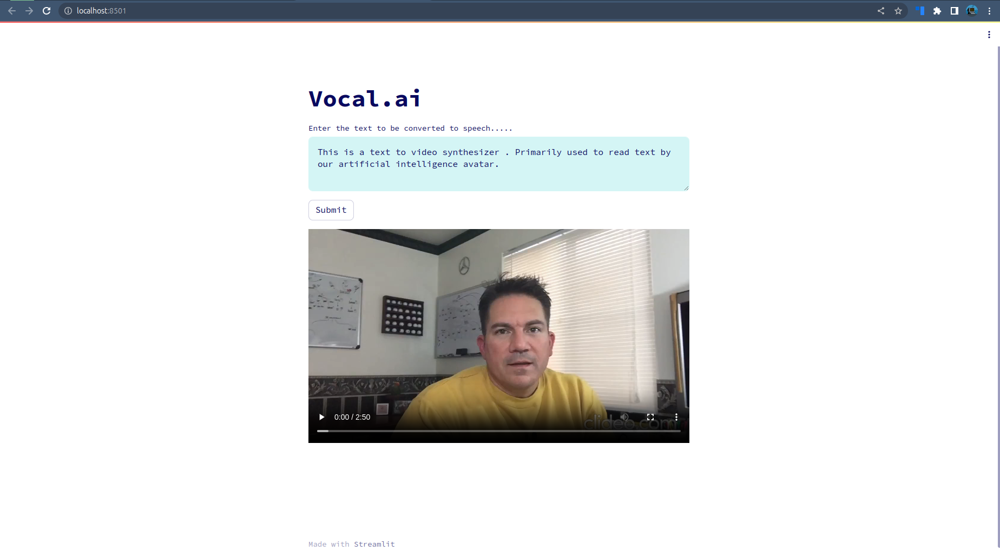

# Vocal.ai 

*Vocal.ai* is an innovative application that allows users to input text and receive a custom-generated video of a person saying that text. The project combines two powerful AI technologies, text-to-speech (TTS) and video synthesis, to create a realistic and dynamic video representation.

## Tech Stack 
 - Waveglow Text to SPeech 
 - Wav2Lip Lip Syncing 

## Key Features:

Text Input: Users can type any desired text into the application's interface. The text can be a sentence, phrase, or even a complete script.

Text-to-Speech (TTS) Conversion: The application leverages advanced TTS models to convert the input text into high-quality audio. The generated audio closely mimics natural human speech with appropriate intonation and emotions.

Realistic Video Synthesis: The project employs state-of-the-art video synthesis techniques to combine the TTS-generated audio with a pre-existing video of a person speaking. The result is a lifelike video of the person articulating the provided text.

Customizable Avatars: Users can choose from a range of pre-captured videos of different individuals or even use their own video footage to personalize the video synthesis process.

Output Formats: The application provides users with various output formats, including common video file formats like MP4 or AVI. Additionally, it allows users to select the video resolution and quality based on their preferences.

Real-Time Preview: To offer instant feedback, the project incorporates real-time preview capabilities. Users can preview the synthesized video before finalizing and exporting it.

